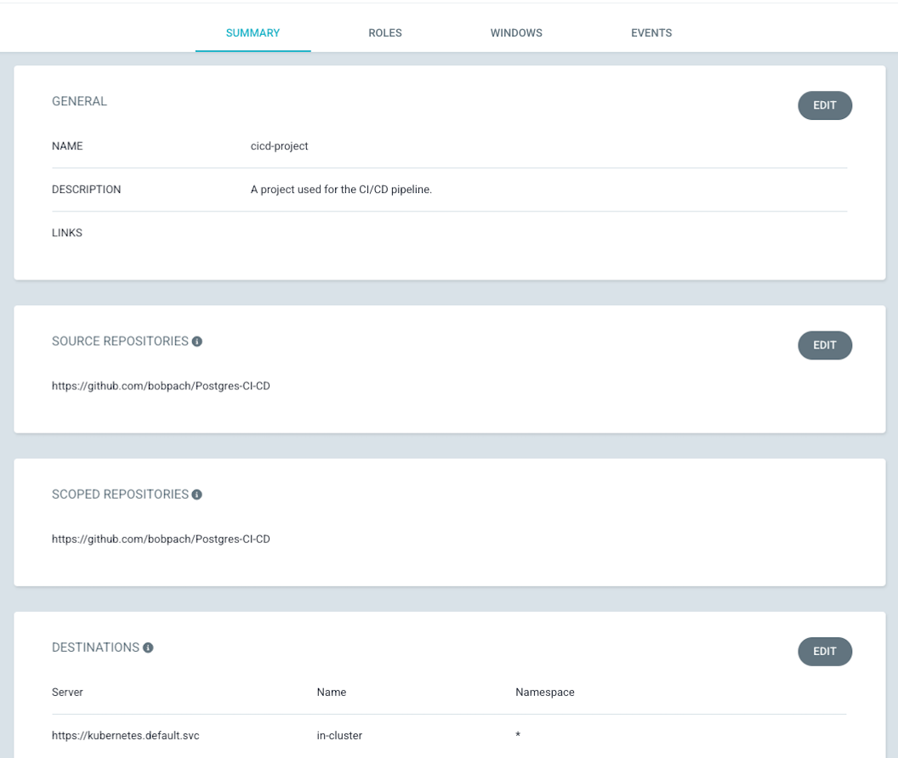
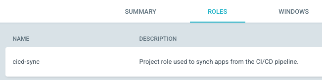
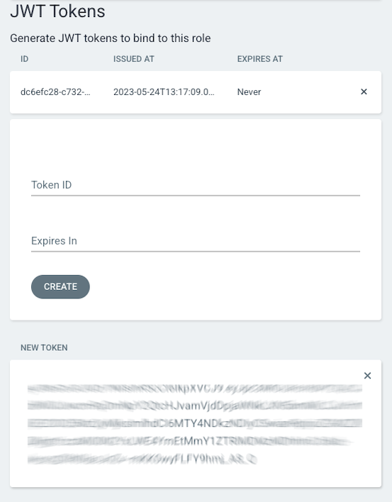

# CI/CD with Crunchy Postgres for Kubernetes and Argo Part -1

Continuous Integration / Continuous Delivery (CI/CD) is an automated approach in which incremental code changes are made, built, tested and delivered. Organizations want to get their software solutions to market as quickly as possible without sacrificing quality or stability.  The automation that CI/CD provides facilitates achieving those accelerated goals by removing roadblocks in the software development lifecycle.  Your software pipeline processes can be fully automated and expanded upon to meet the evolving needs of your software products and business model.

GitOps plays an important part in enabling CI/CD. If you are unfamiliar with Gitops and haven't seen [my blog](https://www.crunchydata.com/blog/postgres-gitops-with-argo-and-kubernetes) you may want to look at that before you proceed here.  In this blog we will build upon what we learned in the GitOps blog.

Using Crunchy Postgres for Kubernetes, ArgoCD and the Crunchy Postgres Self Test container, we will deploy a postgres cluster to a developer namespace, run a series of tests on the deployed cluster and once the tests pass we will automatically deploy the same postgres cluster to a QA namespace.

## Requirements
 - The Crunchy Data Postgres Operator (PGO) v5.3 or later deployed in the kubernetes cluster.  
 - PGO must have the sidecar functionality enabled.  To enable the sidecar functionality you will need to add the following to the `Deployment.spec.template.spec.containers.env` section of the `manager.yaml` file located in the `postgres-operator-examples/kustomize/install/manager` directory.

```yaml
- name: PGO_FEATURE_GATES
  value: 'InstanceSidecars=true'
```
 - ArgoCD v 2.6 or later deployed in the kubernetes cluster.
 - A private container registry containing the images you want to deploy.  Most organizations will pull images, tag them and then upload them into their private registries.  For this blog I am using a private registry for all images except the Crunchy Postgres Self Test.  That image is in a public repo in my docker registry.
 - A git repository containing the Crunchy Postgres for Kubernetes manifest to be deployed.  Here's a sample manifest you can use or you can fork [my git repository](https://github.com/bobpach/Postgres-CI-CD).

<details><summary>- kustomization.yaml</summary>

```yaml
resources:
# - argocd-token.yaml
- hippo-self-test-config.yaml
- postgres.yaml
```
</details>

<details><summary>- postgres.yaml</summary>

```yaml
apiVersion: postgres-operator.crunchydata.com/v1beta1
kind: PostgresCluster
metadata:
  name: hippo
spec:
  image: bobpachcrunchy/crunchy-postgres:ubi8-15.1-5.3.0-1
  imagePullSecrets:
  - name: privatereg
  postgresVersion: 15
  shutdown: false
  users:
    - name: hippo
      options: "SUPERUSER"
  instances:
    - name: pgha1
      replicas: 3
      containers:
        - name: selftest
          image: bobpachcrunchy/postgres-self-test:1.0.0
          imagePullPolicy: IfNotPresent
          env:
            - name: ARGOCD_APP_NAME
              valueFrom:
                configMapKeyRef:
                  name: postgres-self-test-config
                  key: auto-promote-argocd-app-name
            - name: ARGOCD_NAMESPACE
              valueFrom:
                configMapKeyRef:
                  name: postgres-self-test-config
                  key: argocd-namespace
            - name: AUTO_PROMOTE
              valueFrom:
                configMapKeyRef:
                  name: postgres-self-test-config
                  key: auto-promote
            - name: ARGOCD_SERVICE_ADDRESS
              valueFrom:
                configMapKeyRef:
                  name: postgres-self-test-config
                  key: argocd-service-address
            - name: ARGOCD_TOKEN
              valueFrom:
                secretKeyRef:
                  key: token
                  name: argocd-token
            - name: ARGOCD_VERIFY_TLS
              valueFrom:
                configMapKeyRef:
                  name: postgres-self-test-config
                  key: argocd-verify-tls
            - name: DB_USER
              valueFrom:
                configMapKeyRef:
                  name: postgres-self-test-config
                  key: db-user
            - name: DB_USER_PASSWORD
              valueFrom:
                secretKeyRef:
                  key: password
                  name: hippo-pguser-hippo
            - name: CLUSTER_NAME
              valueFrom:
                configMapKeyRef:
                  name: postgres-self-test-config
                  key: cluster-name
            - name: LOG_LEVEL
              valueFrom:
                configMapKeyRef:
                  name: postgres-self-test-config
                  key: log-level
            - name: LOG_PATH
              valueFrom:
                configMapKeyRef:
                  name: postgres-self-test-config
                  key: log-path
            - name: NAMESPACE
              valueFrom:
                fieldRef:
                  apiVersion: v1
                  fieldPath: metadata.namespace
            - name: POSTGRES_CONN_ATTEMPTS
              valueFrom:
                configMapKeyRef:
                  name: postgres-self-test-config
                  key: postgres-conn-attempts
            - name: POSTGRES_CONN_INTERVAL
              valueFrom:
                configMapKeyRef:
                  name: postgres-self-test-config
                  key: postgres-conn-interval
            - name: SERVICE_PORT
              valueFrom:
                configMapKeyRef:
                  name: postgres-self-test-config
                  key: service-port
            - name: SSLMODE
              valueFrom:
                configMapKeyRef:
                  name: postgres-self-test-config
                  key: sslmode
          volumeMounts:
          - name: postgres-data
            readOnly: false
            mountPath: /pgdata
      dataVolumeClaimSpec:
        accessModes:
        - "ReadWriteOnce"
        resources:
          requests:
            storage: 1Gi
      affinity:
        podAntiAffinity:
          preferredDuringSchedulingIgnoredDuringExecution:
          - weight: 1
            podAffinityTerm:
              topologyKey: kubernetes.io/hostname
              labelSelector:
                matchLabels:
                  postgres-operator.crunchydata.com/cluster: hippo
                  postgres-operator.crunchydata.com/instance-set: pgha1         
  backups:
    pgbackrest:
      image: bobpachcrunchy/crunchy-pgbackrest:ubi8-5.3.0-1
      repos:
      - name: repo1
        volume:
          volumeClaimSpec:
            accessModes:
            - "ReadWriteOnce"
            resources:
              requests:
                storage: 1Gi
```
</details>
</br>

**Note:** For this blog the postgres cluster name is "hippo".  You should substitute this name and any other relevant values with your proper information.

## Self Test Container
The Crunchy Postgres Self Test container will be deployed as a sidecar in each Postgres pod.  It runs read, write and delete tests in the cluster and confirms that replication is working as expected across all postgres pods.  If the tests pass it will synch an argocd application resulting in the promotion of the postgres cluster to another namespace.  The sidecar uses a configmap to manage self test behavior and ArgoCD application sync.  More information about the self test container and its configuration can be found [in github](https://github.com/bobpach/Crunchy-Postgres-Self-Test).

<details><summary>- postgres-self-test-config.yaml</summary>

```yaml
apiVersion: v1
data:  
  argocd-namespace: argocd
  argocd-service-address: <ip address of the argocd service>
  argocd-verify-tls: "false"
  auto-promote: "true"
  auto-promote-argocd-app-name: postgres-qa
  db-user: hippo
  cluster-name: hippo
  log-level: info 
  log-path: /pgdata
  postgres-conn-attempts: "12"
  postgres-conn-interval: "5"
  service-port: "5432"
  sslmode: require
kind: ConfigMap
metadata:
  labels:
    vendor: crunchydata
    postgres-operator.crunchydata.com/cluster: hippo
  name: postgres-self-test-config
```
</details>

## ArgoCD
You will need an ArgoCD token to connect to the server to synch the target application after the tests pass.  To get an ArgoCD token you will need to create a repository, project, role and policy. This can be done through the UI or CLI.  For this blog we will use the UI.  See ArgoCD documentation for CLI installation and commands.

### Create an Argocd Repository
To add your git repository to Argo CD click on ‘Settings’ in the
navigation bar on the left.

Click on ‘Repositories’ and the ‘Connect Repo’ buttons. Provide the
necessary information and click ‘Save’. You should now have a connected repo. If
not, please review your settings and try again.

### Create an ArgoCD Project
Create an ArgoCD Project with the following properties:
- Project Name: cicd-project
- Description: A project used for the CI/CD pipeline.
- Source Repositories: < the git repository you registered with argocd >
- Destinations: 
  - Server: https://kubernetes.default.svc
  - Name: in-cluster
  - Namespace: *


<!--  -->

Click on the Roles tab and click the Add Role button.  Create a role and policy with the following properties:
- Role Name: cicd-sync
- Description: Project role used to synch apps from the CI/CD pipeline.
- Action: sync
- Application: cicd-project/*
- Permission: allow

Click the Create button.</br>

<!--  -->
Click on the role name you just created and then click the Create button in the JWT Tokens section of the sidebar.  Click OK when prompted.
Copy and save the New Token in a safe place.</br>

<!--  -->
Click the Update button.</br>
Base 64 encode the New Token.
``` bash
echo < your new token > | base64
```
Copy the base64 encoded new token and paste it into the argocd-token.yaml file

<details><summary>- argocd-token.yaml</summary>

```yaml
apiVersion: v1
data:
  token: <your base64 encoded argocd token>
kind: Secret
metadata:
  name: argocd-token
type: Opaque
```
</details>

For security reasons, you may choose not to store your Argocd token in git.  If that is the case you can create the secret directly in your two namespaces.
```bash
kubectl apply -n postgres-dev -f argocd-token.yaml
secret/argocd-token created
kubectl apply -n postgres-qa -f argocd-token.yaml
secret/argocd-token created
```
Otherwise, you can uncomment the # - argocd-token.yaml line in the kustomization.yaml file and it will get created when the cluster gets created.

### Create the ArgoCD Applications
We will create two Argocd applications.  Create the first one with the following properties:
- General
  - Application Name: postgres-dev
  - Project Name: cicd-project
- Source
  - Repository URL: < the git repository you registered with argocd >
  - Path: < the path to the kustomization file in the git repo >
- Destination:
  - Cluster URL: https://kubernetes.default.svc
  - Namespace: postgres-dev

Click the create button.

Create the second application with the same properties as the first one with two exceptions:
- General
  - Application Name: **postgres-qa**
- Destination:
  - Namespace: **postgres-qa**

Click the create button.</br>

<!--  -->

## Deploy the Crunchy Postgres for Kubernetes Cluster
**Note:** Ensure that all yaml files have been checked into the git repo that you assigned to the cicd-project in ArgoCD.  These files should have all of your edits.  They will be used by ArgoCD to deploy into your postgres-dev and postgres-qa namespaces.

Click the synch button in the postgres-dev Argocd application then click the synchronize button in the right side panel.
The postgres cluster will get deployed into the postgres-dev namespace.

Lets look at the pods in our postgres-dev namespace:
```bash
kubectl get pods -n postgres-dev
NAME                      READY   STATUS      RESTARTS   AGE
hippo-backup-s5pz-bmjsd   0/1     Completed   0          2m5s
hippo-pgha1-2zjd-0        5/5     Running     0          2m29s
hippo-pgha1-9kf7-0        5/5     Running     0          2m29s
hippo-pgha1-mrhq-0        5/5     Running     0          2m29s
hippo-repo-host-0         2/2     Running     0          2m29s
```
Take a look at the self test container logs in the primary postgres pod in the postgres-dev namespace to see if our tests passed.
```bash
kubectl logs $(kubectl get pod -l postgres-operator.crunchydata.com/role=master -o name -n postgres-dev) -n postgres-dev -c selftest
2023-05-24 14:44:24,961 - self_test -           INFO - ******* STARTING NEW TEST RUN *******
2023-05-24 14:44:30,024 - self_test -           INFO - PostgreSQL database version:
2023-05-24 14:44:30,025 - self_test -           INFO - ('PostgreSQL 15.1 on x86_64-pc-linux-gnu, compiled by gcc (GCC) 8.5.0 20210514 (Red Hat 8.5.0-15), 64-bit',)
2023-05-24 14:44:30,032 - self_test -           INFO - Creating test database
2023-05-24 14:44:30,186 - self_test -           INFO - Assigning test_db privileges to test_user
2023-05-24 14:44:30,210 - self_test -           INFO - Creating test_schema in test_db
2023-05-24 14:44:30,404 - self_test -           INFO - Creating test_table with data in test_schema
2023-05-24 14:44:30,417 - self_test -           INFO - Validating DBConnectionType.PRIMARY_SERVICE Data: Expecting 1000 Rows
2023-05-24 14:44:30,418 - self_test -           INFO - *** DBConnectionType.PRIMARY_SERVICE Validation Succeeded! ***
2023-05-24 14:44:40,458 - self_test -           INFO - Validating DBConnectionType.REPLICA_SERVICE Data: Expecting 1000 Rows
2023-05-24 14:44:40,460 - self_test -           INFO - *** DBConnectionType.REPLICA_SERVICE Validation Succeeded! ***
2023-05-24 14:44:40,472 - self_test -           INFO - Validating DBConnectionType.REPLICA_POD Data for podhippo-pgha1-2zjd-0: Expecting 1000 Rows
2023-05-24 14:44:40,473 - self_test -           INFO - *** DBConnectionType.REPLICA_POD Validation Succeeded for pod hippo-pgha1-2zjd-0! ***
2023-05-24 14:44:40,481 - self_test -           INFO - Validating DBConnectionType.REPLICA_POD Data for podhippo-pgha1-9kf7-0: Expecting 1000 Rows
2023-05-24 14:44:40,482 - self_test -           INFO - *** DBConnectionType.REPLICA_POD Validation Succeeded for pod hippo-pgha1-9kf7-0! ***
2023-05-24 14:44:40,663 - self_test -           INFO - Successfully synched the postgres-qa ArgoCD application.
2023-05-24 14:44:40,663 - self_test -           INFO - ******* SUCCESS: ALL TESTS PASSED *******
2023-05-24 14:44:40,664 - self_test -           INFO - Dropping test_table
2023-05-24 14:44:40,667 - self_test -           INFO - Dropping test_schema
2023-05-24 14:44:40,670 - self_test -           INFO - Dropping test_db
2023-05-24 14:44:40,697 - self_test -           INFO - Dropping test_user
```
Now lets look at the pods in our postgres-qa namespace:
```bash
kubectl get pods -n postgres-qa
NAME                      READY   STATUS      RESTARTS   AGE
hippo-backup-wxrx-rhzzh   0/1     Completed   0          63s
hippo-pgha1-7x55-0        5/5     Running     0          81s
hippo-pgha1-jdxw-0        5/5     Running     0          81s
hippo-pgha1-lp89-0        5/5     Running     0          81s
hippo-repo-host-0         2/2     Running     0          81s
```
Lastly, look at the two ArgoCD applications.  They are now both marked as Synched.

## Summary
We were able to deploy, test and promote a Crunchy Postgres for Kubernetes cluster using git and ArgoCD. The declarative nature of the manifest combined with the power of gitops and ArgoCD makes creating a CI/CD pipeline easier than ever.  This blog only covers a segment of a full end to end pipeline.  In my next blog we will look at how to apply new images to an existing application using ArgoCD Image Updater.  Stay tuned for part 2. 
