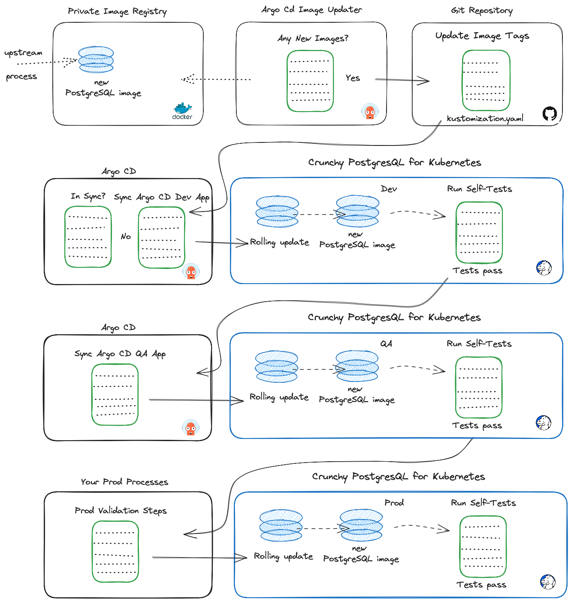

# Use CI/CD to Automatically Update Postgres Images with Argo CD

When working with containers you always have to be mindful of the age of the containers. Everyday new CVEs are being discovered and are turning up in image scans.  One benefit of having a CI/CD pipeline is the ability to implement security automation.  Let's assume you release a monthly update of your containers that are built on the latest version of the base image and all of the most recent patches have been applied.  This ensures that each month you can remediate any CVEs that might have popped up in your images since their initial release.  In this blog we show you how to use ARGO CD Image Updater as part of your CI/CD pipeline to automatically deploy, test and promote your updated images.  All by doing nothing more than putting them into your registry.



This is the part 2 of CI/CD with Crunchy Postgres for Kubernetes and Argo series.  We will pickup from where we left off in [part 1](https://www.crunchydata.com/blog/ci-cd-with-crunchy-postgres-for-kubernetes-and-argo). We will use ArgoCD Image Updater to monitor a private Docker registry for changes to the postgres image tag.  The image updater will update the image tag in github and the ArgoCD application will deploy those changes to the postgres-dev namespace.  Once deployed, the [self-test](https://github.com/CrunchyData/postgres-ci-cd-demo/tree/main/Self-Test-Container) will run and the changes will be applied to the postgres-qa namespace if all tests pass.

## Prerequisites
There are a few pre-requisites you will need to handle if you plan on following along with this example :
- A fully functional ArgoCD deployment and a Crunchy Data Postgres cluster as described in my previous [CI/CD blog](https://www.crunchydata.com/blog/ci-cd-with-crunchy-postgres-for-kubernetes-and-argo).
- A private container registry containing the images you want to deploy. Most
  organizations will pull images, tag them and then upload them into their
  private registries. For this blog I am using a private registry for all images
  except the self test. That image is in a public repo in my docker registry.
- An [access token](https://docs.github.com/en/authentication/connecting-to-github-with-ssh/managing-deploy-keys) for your private registry.
- A git repository containing the Crunchy Postgres for Kubernetes manifest to be
  deployed. Here's a sample manifest you can use or you can fork
  [my git repository](https://github.com/CrunchyData/postgres-ci-cd-demo).
- A [deploy key](https://docs.github.com/en/authentication/connecting-to-github-with-ssh/managing-deploy-keys) with write access to your git repo.

## Secrets
We will need to create some secrets for the registry access token and git deploy key in the argocd namespace.  Sample files are provided in my [git repository](https://github.com/bobpach/Postgres-CI-CD/tree/main/Part-2-Update).  You will need to provide relevant values in the provided sample files and apply them to the argocd namespace.

```bash
kubectl apply -n argocd -f secrets/privaterepo.yaml
kubectl apply -n argocd -f secrets/privatereg.yaml
```

You should already have a secret called argocd-token in the postgres-dev and postgres-qa namespaces.  This secret contains the base64 encoded JWT token that was created in the sync role in the cicd project in ArgoCD.  It was created as part of the initial CI/CD blog. 

## Argo CD Image Updater
[Argo CD Image Updater](https://argocd-image-updater.readthedocs.io/en/stable/) is a tool to automatically update the container images of Kubernetes workloads that are managed by Argo CD.  We will use it to monitor postgres container images in our private docker registry.

### Installation
We will install Argo CD Image Updater into the argocd namespace in our kubernetes cluster.  We already have Argo CD installed there from the previous blog.

``` bash
kubectl apply -n argocd -f https://raw.githubusercontent.com/argoproj-labs/argocd-image-updater/stable/manifests/install.yaml
```

You should now see it in your pod list:

```bash
kubectl -n argocd get po
NAME                                                READY   STATUS    RESTARTS      AGE
argocd-application-controller-0                     1/1     Running   0             80m
argocd-applicationset-controller-685679ccb9-x9962   1/1     Running   0             80m
argocd-dex-server-8f9dbcfb6-zrhgp                   1/1     Running   0             80m
argocd-image-updater-56d94c674d-8ddpf               1/1     Running   0             38s
argocd-notifications-controller-5d65949b4b-spp8p    1/1     Running   0             80m
argocd-redis-77bf5b886-67s9t                        1/1     Running   0             80m
argocd-repo-server-5b889d7495-r9clr                 1/1     Running   0             80m
argocd-server-785bc6f697-pb6cn                      1/1     Running   0             80m
```

We need to inform the argocd-image-updater container about the location of the private registry that it will be monitoring for updates.  We can do this by adding the following to the data property in the argocd-image-updater-config configmap in the argocd namespace:

```yaml
data:
  registries.conf: |
    registries:
    - name: Docker Hub
      prefix: docker.io
      api_url: https://registry-1.docker.io
      credentials: pullsecret:argocd/privatereg
      defaultns: library
      default: true
```
We also need to assign policy information for the image updater.  We can do this by adding the following to the data property in the argocd-rbac-cm configmap in the argocd namespace:

```yaml
data:
  policy.csv: |
    p, role:image-updater, applications, get, */*, allow
    p, role:image-updater, applications, update, */*, allow
    g, image-updater, role:image-updater
  policy.default: role:readonly
```


## Argo CD Applications
In the previous CI/CD blog we created two applications:
- postgres-dev
- postgres-qa
### Annotations
We want Argo CD Image Updater to update our kustomization file in git with new image tags for images that it finds in our private repo.  In order to do that we will have to add annotations in the postgres-dev application.

In the ARGO CD UI click on applications in the left pane.  Click on the postgres-dev application. Click on APP Details in the top bar.  Click edit in the top right of the application pane.  Click the + button to add a new annotation.  Enter the key and value.  Do this for each annotation as listed below.

- argocd-image-updater.argoproj.io/image-list: postgres=<your_registry_name>/<your_image_name>
  - e.g: argocd-image-updater.argoproj.io/image-list: postgres=bobpachcrunchy/crunchy-postgres 
- argocd-image-updater.argoproj.io/postgres.update-strategy: latest
- argocd-image-updater.argoproj.io/write-back-method: git
- argocd-image-updater.argoproj.io/git-branch: main
- argocd-image-updater.argoproj.io/write-back-target: kustomization


Click Save.

## Kustomize
In order for ArgoCD Image Updater to update our images in git we need to change how we reference our image tags.  In the previous CI/CD blog we referenced them in in the PostgresCluster custom resource itself.  Now we will move the postgres image tag into the kustomization.yaml file.  We will add a transformer and remove the tag from the custom resource.
### Transformer
postgres-cluster-image-transformer.yaml
```yaml
images:
- path: spec/image
  kind: PostgresCluster
```
### Kustomization.yaml
kustomization.yaml
#### Before
```yaml
resources:
- postgres-self-test-config.yaml
- postgres.yaml
```
#### After
```yaml
configurations:
- postgres-cluster-image-transformer.yaml
images:
- name: bobpachcrunchy/crunchy-postgres
  newTag: ubi8-15.1-5.3.0-1
resources:
- postgres-self-test-config.yaml
- postgres.yaml
```
### Postgres Cluster
postgres.yaml
#### Before
```yaml
spec:
  image: bobpachcrunchy/crunchy-postgres:ubi8-15.1-5.3.0-1
```
#### After
```yaml
spec:
  image: bobpachcrunchy/crunchy-postgres
```
Check these changes into your git repo.  They will be required before updating the postgres image in the registry.

## Deploy the clusters
If you don't already have your postgres clusters up and running, synch the postgres-dev ArgoCD application.  This will deploy the postgres cluster to the postgres-dev namespace and will run the self test which will synch the postgres cluster to the postgres-qa namespace.  

Verify both clusters deployed.
```bash
kubectl -n postgres-dev get pods
NAME                      READY   STATUS      RESTARTS   AGE
hippo-backup-5vvr-h2zmd   0/1     Completed   0          3m41s
hippo-pgha1-7lng-0        5/5     Running     0          4m2s
hippo-pgha1-g8xx-0        5/5     Running     0          4m3s
hippo-pgha1-nnrm-0        5/5     Running     0          4m2s
hippo-repo-host-0         2/2     Running     0          4m2s

kustomize % kubectl -n postgres-qa get pods
NAME                      READY   STATUS      RESTARTS   AGE
hippo-backup-r4p8-z4689   0/1     Completed   0          3m32s
hippo-pgha1-4992-0        5/5     Running     0          3m54s
hippo-pgha1-4cmv-0        5/5     Running     0          3m54s
hippo-pgha1-mzfm-0        5/5     Running     0          3m54s
hippo-repo-host-0         2/2     Running     0          3m54s
```
Both postgres clusters are up and running.  Lets take a look at the postgres image version we deployed for each cluster.  We will describe the stateful sets for each namespace.  

Note: Results shown below have been truncated for readability.

```bash
kubectl get -n postgres-dev sts -o wide | grep crunchy-postgres
hippo-pgha1-7lng   1/1     7m2s   bobpachcrunchy/crunchy-pgbackrest:ubi8-5.3.0-1
hippo-pgha1-g8xx   1/1     7m3s   bobpachcrunchy/crunchy-pgbackrest:ubi8-5.3.0-1
hippo-pgha1-nnrm   1/1     7m3s   bobpachcrunchy/crunchy-pgbackrest:ubi8-5.3.0-1

kubectl get -n postgres-qa sts -o wide | grep crunchy-postgres
hippo-pgha1-4992   1/1     7m1s   bobpachcrunchy/crunchy-pgbackrest:ubi8-5.3.0-1
hippo-pgha1-4cmv   1/1     7m1s   bobpachcrunchy/crunchy-pgbackrest:ubi8-5.3.0-1
hippo-pgha1-mzfm   1/1     7m1s   bobpachcrunchy/crunchy-pgbackrest:ubi8-5.3.0-1
```


## Time to Automate Updates
We have completed all of the prep work.  Now its time to automate updates.  We need to make one more change to the postgres-dev application in Argo CD.  We will edit the application and enable auto-sync.
- Click on applications in the left panel.
- Click on the postgres-dev application
- Click the App Details button in the top panel.
- Click the Enable Auto-Sync button in the Sync Policy Pane of the panel.
- Click OK on the confirmation dialogue. 

We are ready to push an updated image into our private registry.  Here is my registry before I push the updated image:


Ensure you have docker running.  We will pull the new image, tag it and push it into our private registry.

```bash
docker pull registry.crunchydata.com/crunchydata/crunchy-postgres:ubi8-15.3-5.3.2-1
docker tag registry.crunchydata.com/crunchydata/crunchy-postgres:ubi8-15.3-5.3.2-1 bobpachcrunchy/crunchy-postgres:ubi8-15.3-5.3.2-1
docker push bobpachcrunchy/crunchy-postgres:ubi8-15.3-5.3.2-1
```

I now see my new image in my private repo:


Argo CD Image Updater is monitoring my docker registry.  It see's that I have a new image and it connects to my git repo to update the image tag in my kustomization.yaml file.

A quick look at the argo-cd-image-update logs shows:

```bash
time="2023-08-03T19:36:23Z" level=info msg="Processing results: applications=1 images_considered=1 images_skipped=0 images_updated=0 errors=0"                                │
time="2023-08-03T19:38:23Z" level=info msg="Starting image update cycle, considering 1 annotated application(s) for update"                                                   │
time="2023-08-03T19:38:23Z" level=info msg="Setting new image to bobpachcrunchy/crunchy-postgres:ubi8-15.3-5.3.2-1" alias=postgres application=postgres-dev image_name=bobpac │
time="2023-08-03T19:38:23Z" level=info msg="Successfully updated image 'bobpachcrunchy/crunchy-postgres:ubi8-15.1-5.3.0-1' to 'bobpachcrunchy/crunchy-postgres:ubi8-15.3-5.3. │
time="2023-08-03T19:38:23Z" level=info msg="Committing 1 parameter update(s) for application postgres-dev" application=postgres-dev
```

A look in git shows a commit message of: "build: automatic update of postgres-dev".  The kustomization.yaml file now has the updated image tag.

```bash
configurations:
- postgres-cluster-image-transformer.yaml
images:
- name: bobpachcrunchy/crunchy-postgres
  newTag: ubi8-15.3-5.3.2-1
resources:
- postgres-self-test-config.yaml
- postgres.yaml
```
The postgres-dev Argo CD app is set to auto-synch.  By default auto-synch will fire every 3 minutes.  When it does fire, it will see that it is out of sync with the git repo and reapply the manifest.  The postgres pods go into a rolling restart process.  Each replica pod will be taken down one at a time and re-initialized with the new image.  After all replica pods are updated a failover happens to elect an updated replica to the primary pod role.  The former primary is then brought down and re-initialized as a replica with the new image.  At this point, all postgres pods in the postgres cluster are running the new image with the only downtime being the few seconds for failover to happen.

The self-test container ran after the replica was promoted to primary.  It then calls the synch command on the postgres-qa Argo CD app and that postgres cluster also gets its images updated in the same manner.

Both postgres clusters have now been updated.  Lets take a look at the postgres image version we updated for each cluster.  We will describe the stateful sets for each namespace.  

Note: Results shown below have been truncated for readability.

```bash
kubectl get -n postgres-dev sts -o wide | grep crunchy-postgres
hippo-pgha1-svkv   1/1     17m   bobpachcrunchy/crunchy-postgres:ubi8-15.3-5.3.2-1
hippo-pgha1-x7qf   1/1     17m   bobpachcrunchy/crunchy-postgres:ubi8-15.3-5.3.2-1
hippo-pgha1-zgcq   1/1     17m   bobpachcrunchy/crunchy-postgres:ubi8-15.3-5.3.2-1

kubectl get -n postgres-qa sts -o wide | grep crunchy-postgres
hippo-pgha1-fw9r   1/1     18m   bobpachcrunchy/crunchy-postgres:ubi8-15.3-5.3.2-1
hippo-pgha1-r9zk   1/1     18m   bobpachcrunchy/crunchy-postgres:ubi8-15.3-5.3.2-1
hippo-pgha1-tf22   1/1     18m   bobpachcrunchy/crunchy-postgres:ubi8-15.3-5.3.2-1
```

## Summary
Using Argo CD, Git, Docker Hub and the self-test container we were able to automatically deploy, test and promote a new postgres image to postgres clusters in dev and test namespaces by doing nothing more than pushing an updated image into a docker registry that argocd-image-updater was monitoring.  CI/CD processes like these can rapidly decrease you time to market with new container images without sacrificing quality or reliability.

